# Ancient Code of Mine

The oldest source code I've managed to keep until now. Pure Turbo Pascal, pure fun.

## [LOD - 25 November 1997](LOD/LOD.PAS)

I was 14 years old. It features shared global mutable state and probably all
antipatterns you have ever heard about. But for me it's the best code I've ever
written.

## [F&D - 4 January 1998](F&D/F&D.PAS)

Find & Destroy. Stunning itro, dynamic graphics, but there's nothing more
unfortunately.

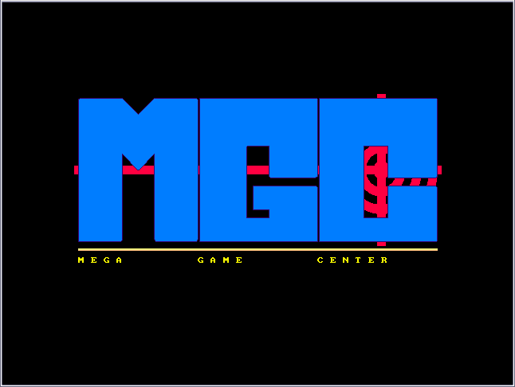
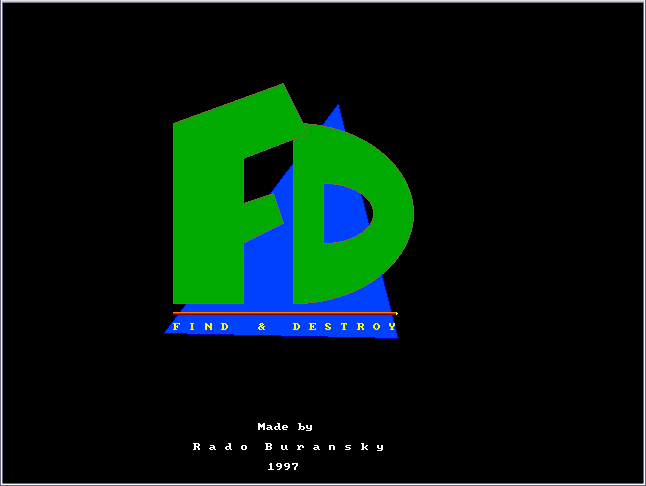

## [MINY - 21 May 1998](MINY/MINY.PAS)

Enter size of the grid, enter number of mines and play the classical Windows game.

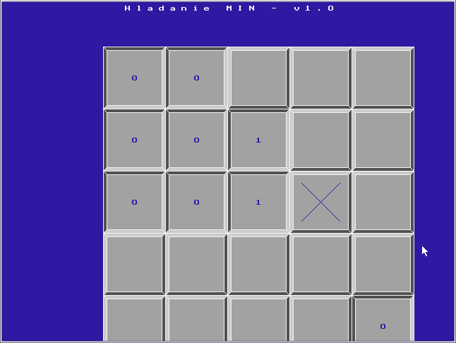

## [CERVIKY - 17 June 1998](CERVIKY/CERVIKY.PAS)

Multiplayer worms game where the goal is not to crash. The last one wins. Worms
can also fire bricks or what is that.

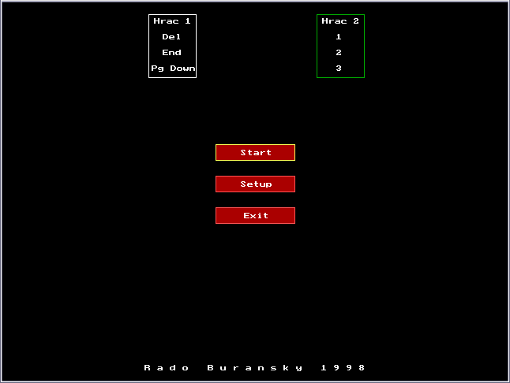
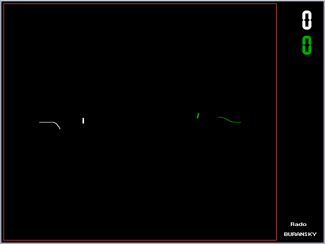

## [BILIARD - 4 November 1998](BILIARD/BILIARD.PAS)

Somehow handles collisions of a pool cue ball with cushions.  

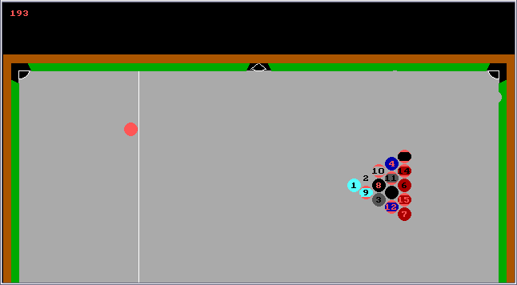

## [TETRIS - 26 November 1998](TETRIS/TETRIS.PAS)

## [PISKVORK - 13 December 1998](PISKVORK/PISKVORK.PAS)

Tic-tac-toe made by Mega Game Center!

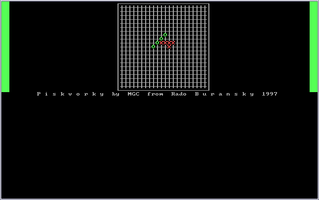

## [ARKANOID - 27 April 1999](ARKANOID/ARKANOID.PAS)

Ball bouncing game controlled by mouse. 

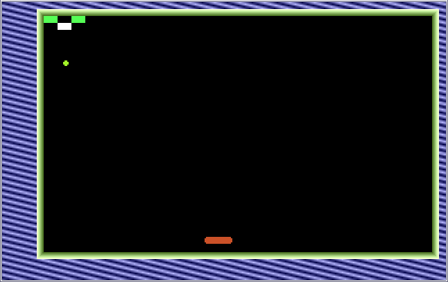

## [MORPH - 27 April 1999](MORPH/MORPH.PAS)

Stone-stealing game featuring computer player.

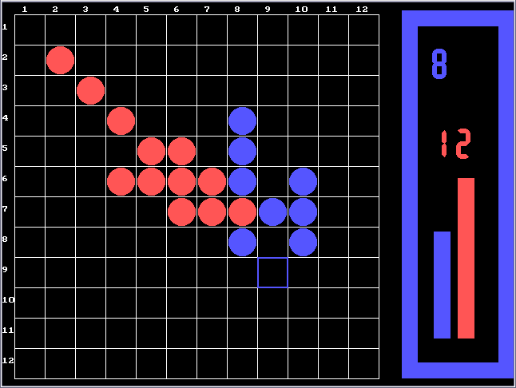

## [MECIAR - 15 May 1999](MECIAR/MECIAR.PAS)

Thrilling game of a fly jumping from one shrinking lotus leaf to another, trying
to collect as many gems as possible while running away from frog. Named by and
dedicated to the current Slovak f*cking prime minister Vladimir Meciar.

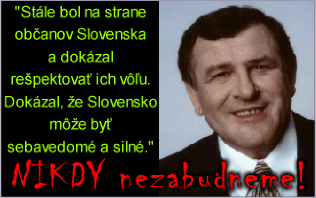
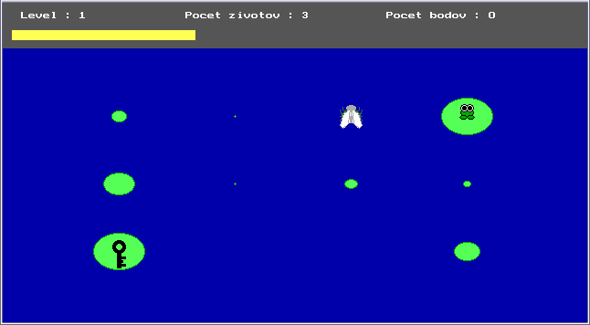
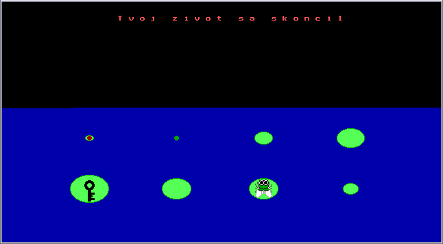