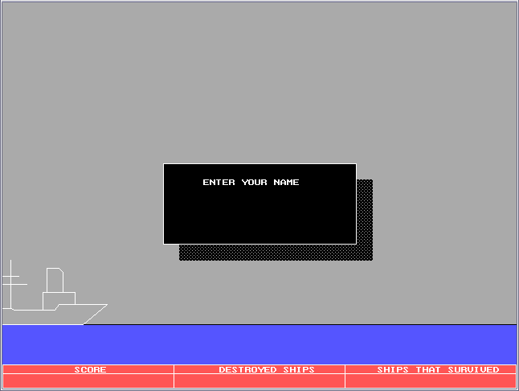
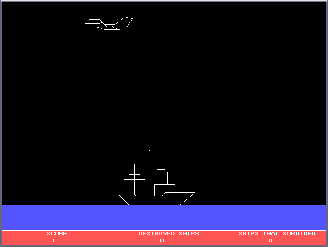
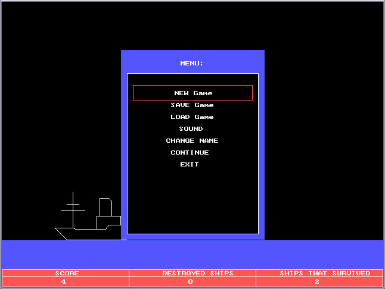

# Ancient Code of Mine

The oldest source code I've managed to keep until now. Pure Turbo Pascal, pure fun.

## LOD - 25 November 1997

I was 14 years old. It features shared global mutable state and probably all
antipatterns you have ever heard about. But for me it's the best code I've ever
written.

